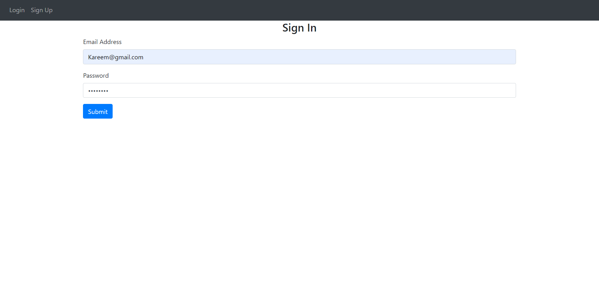
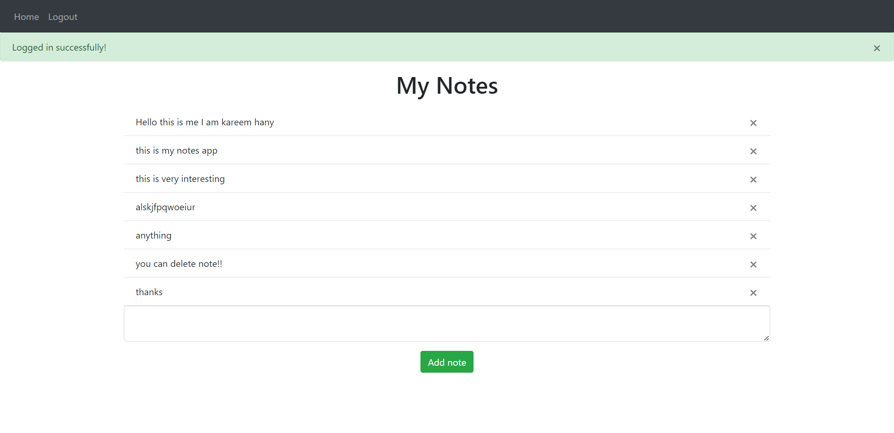
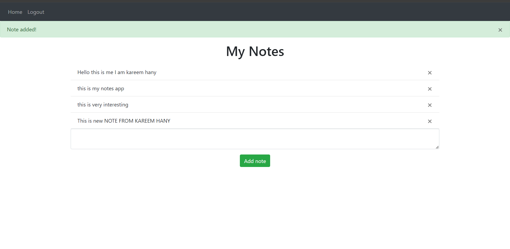

# "Note Management Web Application with Flask"

In this project i learned:
- How to use SQLAlchemy and create tables
- How to make an Authentication system so user can login, logout, sign up
- How to use python packages and organize files
- How to use blueprint in flask
- How to create flask routes for our website
- Templating lagnuage (jinja)

```
notes-app
|
├── README.md
├── instance
│   └── database.db
├── requirements.txt
├── run.py
└── website
    ├── __init__.py
    ├── auth.py
    ├── models.py
    ├── static
    │   └── delete_note.js
    ├── templates
    │   ├── base.html
    │   ├── home.html
    │   ├── login.html
    │   └── sign_up.html
    └── views.py
```
**Technologies**:

`python`
`sqlite` 
`Flask`
`jinja`
`SQLAlchemy`
`HTML` `CSS` `Bootstrap`

- Login or Sign up



- Home page


 
 - Add new notes and remove old notes


