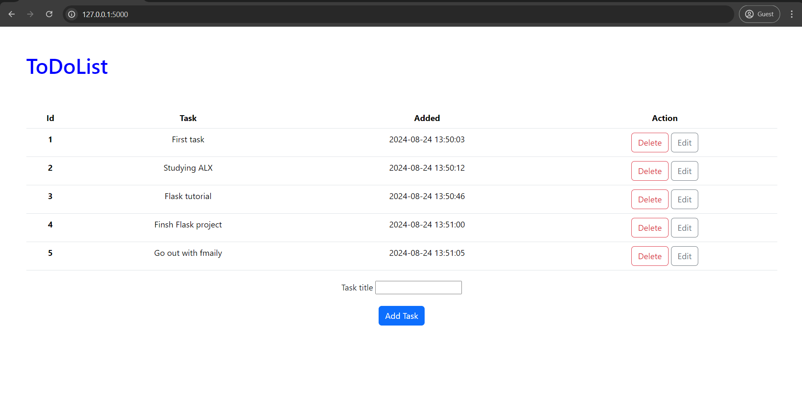
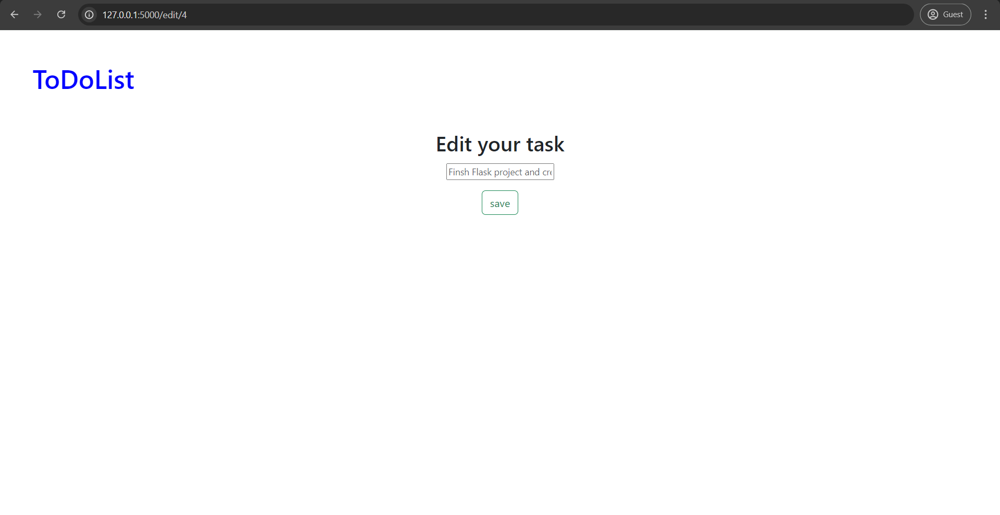
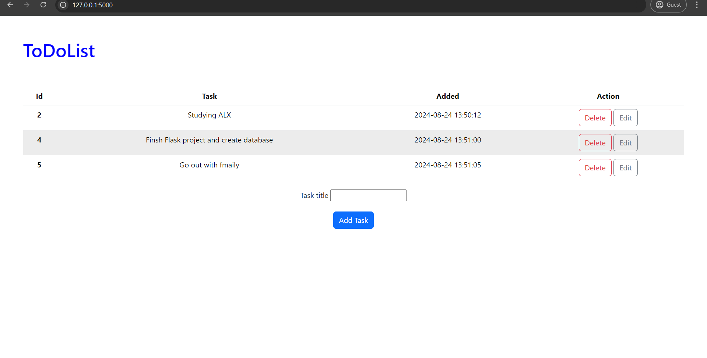

# ToDoList
In this project i create a simple to-do list webiste that 
you we can applay the CRUD operation on this project for 
create new task, edit existing task, delete task.

### Technologies

- Python with Flask web framework
- HTML, CSS, Boostrap
- Database SQLlite

***How to Run application***
- to run the project you need first to check that you install the technologies that 
required for this project flask, flask_sqlalchemy, etc..

run : `
python main.py
`

